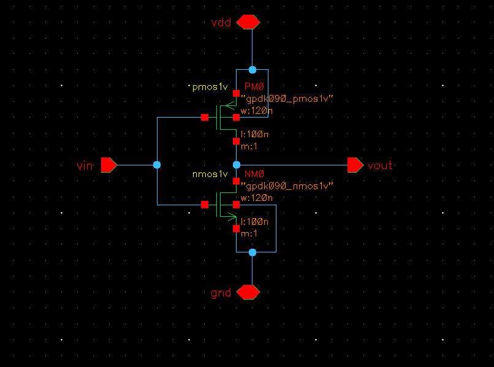
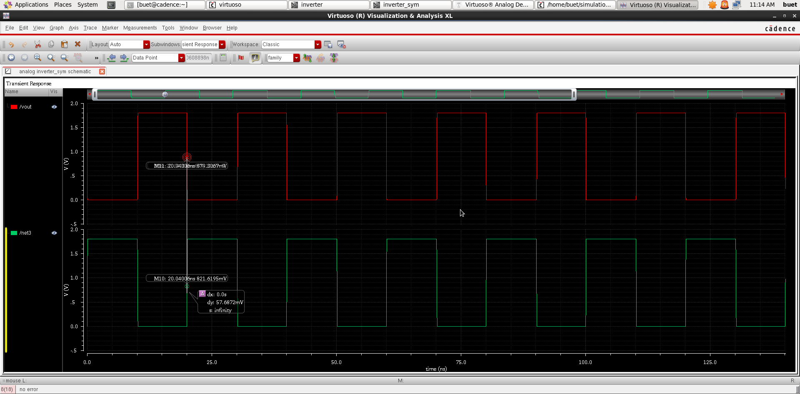
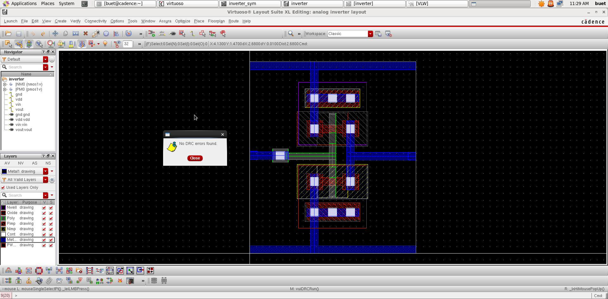
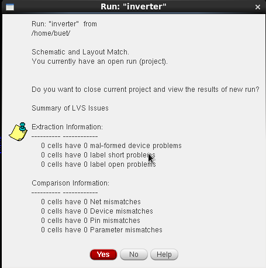
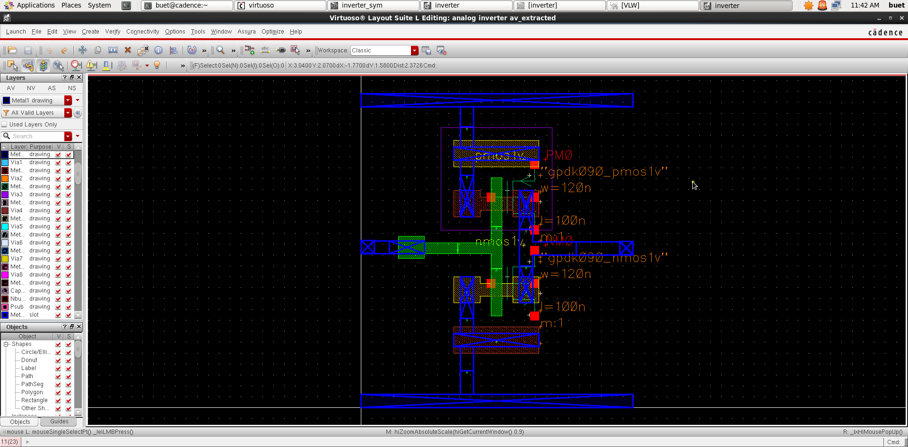
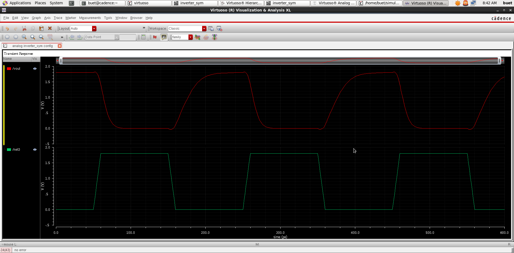
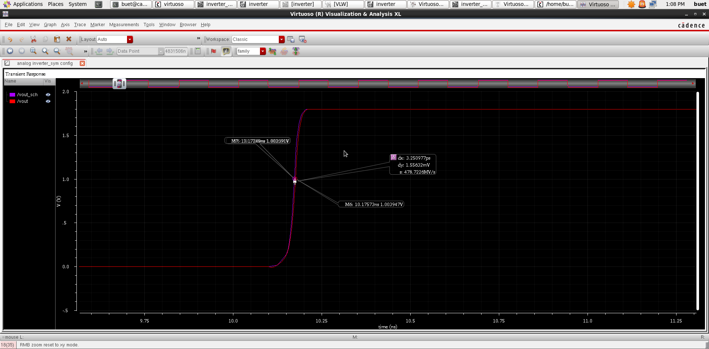
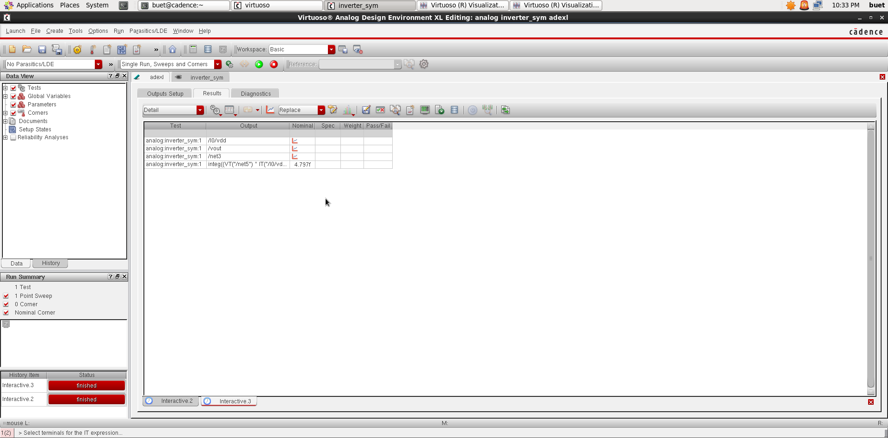

# CMOS Inverter Design using Cadence Virtuoso

## Project Overview

This project demonstrates the complete custom IC design flow of a CMOS inverter using **Cadence Virtuoso**. The design process begins with schematic capture and functional verification, followed by physical layout implementation, design verification, parasitic extraction, post-layout simulation, propagation delay estimation, power analysis, and performance comparison.

The objective of this project is to understand the impact of physical layout parasitics on circuit performance while gaining practical experience with the Cadence Virtuoso design environment.

---

# Objectives

- Design a CMOS inverter using Cadence Virtuoso.
- Verify the inverter functionality through schematic simulation.
- Create the physical layout following technology design rules.
- Perform Design Rule Check (DRC).
- Perform Layout Versus Schematic (LVS) verification.
- Perform RC (Parasitic) Extraction.
- Estimate propagation delay.
- Calculate average power consumption.
- Compare pre-layout and post-layout performance.

---

# Software and Technology

| Parameter | Value |
|-----------|-------|
| Design Tool | Cadence Virtuoso |
| Simulator | Spectre |
| Technology | GPDK90 |
| Operating System | Ubuntu |
| Supply Voltage | 1.8 v |
| Load Capacitance | 1 fF |

---

# Design Specifications

| Parameter | Value |
|-----------|-------|
| NMOS W/L | 100 nm / 120 nm |
| PMOS W/L | 100 nm / 120 nm |
| Rise Time | 10 ps |
| Fall Time | 10 ps |
| Pulse Width | 90 ps |
| Period | 200 ps |
| Input Source | VPULSE |

---

# Design Flow

```text
Specification
      │
      ▼
Schematic Design
      │
      ▼
Pre-layout Simulation
      │
      ▼
Layout Design
      │
      ▼
Design Rule Check (DRC)
      │
      ▼
Layout Versus Schematic (LVS)
      │
      ▼
RC Extraction
      │
      ▼
Post-layout Simulation
      │
      ▼
Propagation Delay Estimation
      │
      ▼
Power Estimation
      │
      ▼
Performance Comparison
```

---

# 1. Schematic Design

The CMOS inverter schematic was designed using one PMOS transistor and one NMOS transistor connected in complementary configuration.

## Schematic



### Description

- PMOS connected to VDD.
- NMOS connected to Ground.
- Gates connected together as the input.
- Drains connected together as the output.

---

# 2. Pre-layout Simulation

Transient analysis was performed on the schematic to verify the functionality of the inverter before physical layout implementation.

## Pre-layout Transient Response



### Observation

- Output correctly inverts the input signal.
- Simulation performed without layout parasitic effects.

---

# 3. Layout Design

The physical layout was created according to the GPDK90 design rules.

## Layout



### Features

- Poly gates
- Active diffusion
- Metal routing
- Contacts
- Proper transistor placement

---

# 4. Design Rule Check (DRC)

DRC was performed to verify that the layout satisfies all fabrication design rules.

## DRC Result


### Result

- **Status:** PASS
- **Errors:** 0

---

# 5. Layout Versus Schematic (LVS)

LVS was performed to verify that the physical layout is electrically equivalent to the schematic.

## LVS Result



### Result

- **Status:** PASS
- **Layout matches the schematic successfully.**

---

# 6. RC Extraction

Parasitic resistance and capacitance were extracted from the layout to generate the extracted view used for post-layout simulation.

## RC Extraction



### Description

The extracted view includes:

- Wire resistance
- Wire capacitance
- Diffusion capacitance
- Contact parasitics

These parasitic components provide a more realistic representation of the fabricated circuit.

---

# 7. Post-layout Simulation

The extracted view was simulated using the same testbench and operating conditions as the pre-layout simulation.

## Post-layout Transient Response



### Observation

The post-layout simulation includes parasitic RC effects, resulting in a more realistic representation of circuit behavior.

---

# 8. Propagation Delay Estimation

Propagation delay was measured using the **Cadence Virtuoso ADE L Calculator** based on the **50% voltage crossing** of the input and output waveforms.

## Delay Measurement



### Pre-layout Delay

| Parameter | Value |
|-----------|-------|
| tPLH | 172.596ps |
| tPHL | 63.5279ps |
| Average Delay | 117.926ps |

### Post-layout Delay

| Parameter | Value |
|-----------|-------|
| tPLH | 174.457ps |
| tPHL | 64.443ps |
| Average Delay | 119.45ps |

---

# 9. Power Estimation

Energy per switching cycle was obtained through simulation, and the average power consumption was calculated.

## Power Estimation



### Pre-layout Power

| Parameter | Value |
|-----------|-------|
| Energy / Cycle | 4.767f J |
| Average Power | 23.835 uW |

### Post-layout Power

| Parameter | Value |
|-----------|-------|
| Energy / Cycle | 5.344f J |
| Average Power | 26.720 uW |

---

# 10. Pre-layout vs Post-layout Comparison

| Parameter | Pre-layout | Post-layout |
|-----------|-----------:|------------:|
| tPLH | 172.596ps | 174.457ps |
| tPHL | 63.5279ps | 64.443ps |
| Average Delay | 117.926ps | 119.45ps |
| Energy / Cycle | 4.767f J | 5.344f J |
| Average Power | 23.835 uW | 26.720 uW |

---

# Observations

- The inverter successfully passed both DRC and LVS verification.
- RC extraction introduced parasitic resistance and capacitance into the design.
- Post-layout simulation exhibited slightly different electrical characteristics compared to the schematic-level simulation.
- The differences in delay and power are attributed to the additional parasitic components present in the physical layout.
- Equal PMOS and NMOS transistor dimensions resulted in different rise and fall delays due to the lower carrier mobility of holes in PMOS devices.

---


# Author

**Name:** *Vetcha Sri Saravan*

**Repository:** CMOS Inverter Design using Cadence Virtuoso

**Technology:** GPDK90

**Tool:** Cadence Virtuoso
